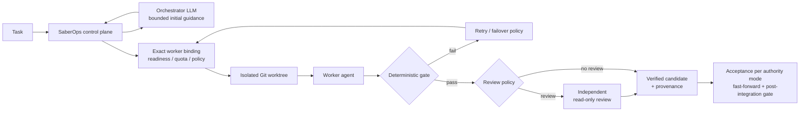

# SaberOps

[](https://github.com/sabers13/SaberOps/actions/workflows/ci.yml)
[](LICENSE)

[](https://github.com/sabers13/SaberOps/tags)

**A local control plane for supervised, multi-model AI engineering.**

SaberOps lets AI models propose software changes while deterministic code controls **what may run, which exact model is used, how work is isolated, what counts as success, and what may be accepted into the repository**.

> **Core principle: the LLM advises; deterministic software decides.**

> [!IMPORTANT]
> **v0.3.6 is the approved OpenDesign production UI integration.** It preserves the v0.3.5 execution/routing/monitoring backend while replacing the legacy dashboard presentation with the approved OpenDesign console shell. No execution, routing-policy, monitoring, or provider-handling change. This release is **not** production-ready, stable, or complete.

---

## Why SaberOps?

A coding agent can propose a patch. The harder engineering problem is deciding whether that patch was produced under the right authority, by the intended model, against the intended repository state, and whether it is safe to accept.

SaberOps separates **semantic work** from **execution authority**:

| AI models | Deterministic SaberOps control plane |
| --- | --- |
| Orchestrator LLM provides one bounded piece of initial task guidance | Validates exact provider/backend/model bindings |
| Worker model proposes implementation changes | Enforces routing admission, readiness, quota, and policy |
| Optional reviewer provides an independent read-only assessment | Owns Git worktrees, gates, provenance, durable state, and acceptance |
| Models never decide whether their own result is accepted | Fails closed when required evidence is missing |

---

## How it works



A normal run follows these boundaries:

1. **Admission.** SaberOps selects or validates an exact worker binding and checks the evidence required by routing policy.
2. **Isolation.** Each attempt gets its own Git worktree, keeping candidate changes separate from the source checkout.
3. **Execution.** The selected worker adapter receives the bounded task context and exact execution identity.
4. **Verification.** Your deterministic gate (for example `pytest -q` or `make gate`) decides whether the candidate passes.
5. **Review.** Review can be required explicitly or selected by a risk-adaptive policy; reviewers are read-only.
6. **Acceptance.** Only a verified candidate can be integrated, fast-forward only, followed by a post-integration gate. In the default `supervised` mode this requires an explicit `orch accept`; see [Authority modes](#authority-modes).
7. **Durability.** Run state, events, provenance, and decisions are persisted so interrupted runs can be inspected and reconciled.

---

## Key design decisions

### Exact execution identity

SaberOps preserves provider, backend, and model identity from discovery through binding and dispatch. Same-named models from different upstreams remain distinct, and exact bindings prevent silent sibling-model or first-match substitution.

### Separate Orchestrator and worker roles

The Orchestrator model and worker models use separate role-bound execution bindings. Changing the Orchestrator selection does not reorder worker routing, and a worker-role binding cannot be used as the Orchestrator binding.

### Provenance before acceptance

A candidate is tied to the run, objective, and base revision that produced it. Acceptance is based on verified provenance, not simply on the existence of an agent-generated commit.

### Truthful capability handling

SaberOps does not invent model capabilities. If no controllable reasoning-effort tier is known and no tier was explicitly requested, the provider default is used. Explicit unsupported requests fail closed.

### Connections are not authorization

Saving or probing a provider connection does not authorize execution. Discovery, exact binding, readiness, and routing admission remain separate checks.

---

## Authority modes

How much SaberOps may do without asking is an explicit, persisted owner setting. Unknown mode values fail closed and never degrade into a more permissive mode.

| Mode | May accept verified candidates without asking | Publishes candidate branch |
| --- | :---: | :---: |
| `ask_before_actions` | No | No |
| `supervised` (default) | No | No |
| `autonomous` | No | Yes |
| `full_autonomy` | Yes | Yes |
| `full_autonomy_publish` | Yes | Yes |

Acceptance authority never bypasses verification; a candidate must still satisfy the fail-closed acceptance requirements. `full_autonomy_publish` additionally grants publication of accepted work, but v0.3.6 has no governed publication command, so it stops at the accepted state. Inspect or change the mode with `orch authority show`, `orch authority list`, and `orch authority set`.

---

## Requirements

- Python **3.12+**
- Git
- For real provider-backed runs: the relevant provider CLI installed and authenticated through that provider's normal mechanism

SaberOps does not ship a model and does not require provider credentials for its test suite or CI.

---

## Installation

```bash
git clone https://github.com/sabers13/SaberOps.git
cd SaberOps

python3.12 -m venv .venv
source .venv/bin/activate
python -m pip install .

orch --help
```

For development:

```bash
python -m pip install -e ".[dev]"
```

---

## Quick start

Inspect your local environment and a target repository:

```bash
orch doctor --repo /path/to/project
orch models
orch authority show
```

Start the local dashboard (binds to `127.0.0.1:8765` by default):

```bash
orch ui --repo /path/to/project
```

### Example provider-backed run

> [!WARNING]
> v0.3.6 provides the approved OpenDesign console over the v0.3.5 owner-configured provider execution backend (discovery, worker routing, separate Orchestrator-model selection, live monitoring, canonical reports, always-bounded worker execution with explicit `--worker-timeout` else tier default T1=600s/T2=1200s/T3=1800s). This is still a preview release: not production-ready, stable, or complete.

After installing and authenticating a supported provider CLI:

```bash
orch run \
  --repo /path/to/project \
  --task "Add input validation to the CSV importer" \
  --gate "pytest -q" \
  --review
```

Then inspect and, if appropriate, accept the verified result:

```bash
orch status <run_id>
orch events <run_id>
orch report <run_id>   # Canonical read-only run report (text, or --json for the deterministic payload)
orch monitor <run_id>  # Follow a run live with the canonical projection (read-only)
orch accept <run_id>
orch cleanup <run_id>
```

Run `orch <command> --help` for the full command and option reference. Runtime state, databases, worktrees, and logs live outside the installed package in XDG or project-local locations. Commands that operate on run state accept `--db PATH` where applicable.

---

## Worker adapters

| Adapter | Implemented in the codebase |
| --- | :---: |
| Codex | Yes |
| Copilot | Yes |
| Cline | Yes |
| OpenCode | Yes |
| Antigravity | Yes |

"Implemented" means the adapter exists in the codebase. It does **not** mean that every adapter has been live-certified against a real provider account in v0.3.6.

---

## Security and execution boundaries

- Provider authentication remains with the provider's normal mechanism. Credential references may be stored; secret values are not.
- Do not put credentials in source, committed configuration, or task text.
- The dashboard binds to localhost by default.
- Host access for workers is `governed` by default. `unrestricted` exists as an explicit owner choice (`orch authority set-host-access`); worktree isolation separates candidate changes, it is not a sandbox against a worker with unrestricted host access.
- Missing required admission evidence causes a refusal rather than an inferred approval.
- Tests and CI make no provider or model calls.

---

## Development

```bash
python -m pip install -e ".[dev]"

ruff check .
mypy --strict src tests
pytest -q
```

GitHub Actions runs the same checks on Python 3.12 without provider credentials or model calls.

### Repository layout

```text
src/saberops/            runtime package
tests/                   public capability tests
.github/workflows/       public CI
pyproject.toml           package metadata and tool configuration
LICENSE                  Apache License 2.0
THIRD_PARTY_NOTICES.md   shipped third-party notices
```

---

## Current limitations

- v0.3.6 is the approved OpenDesign production UI integration: it preserves the v0.3.5 execution/routing/monitoring backend (always-bounded worker execution with explicit `--worker-timeout` else tier default T1=600s/T2=1200s/T3=1800s, live monitoring, canonical reports, discovery, routing, bindings, detached execution) while replacing the legacy dashboard presentation.
- This is a preview release: interfaces and workflows may change.
- SaberOps is not production-ready, stable, or feature-complete.

---

## License

Apache License 2.0. See [LICENSE](LICENSE) and [THIRD_PARTY_NOTICES.md](THIRD_PARTY_NOTICES.md).
